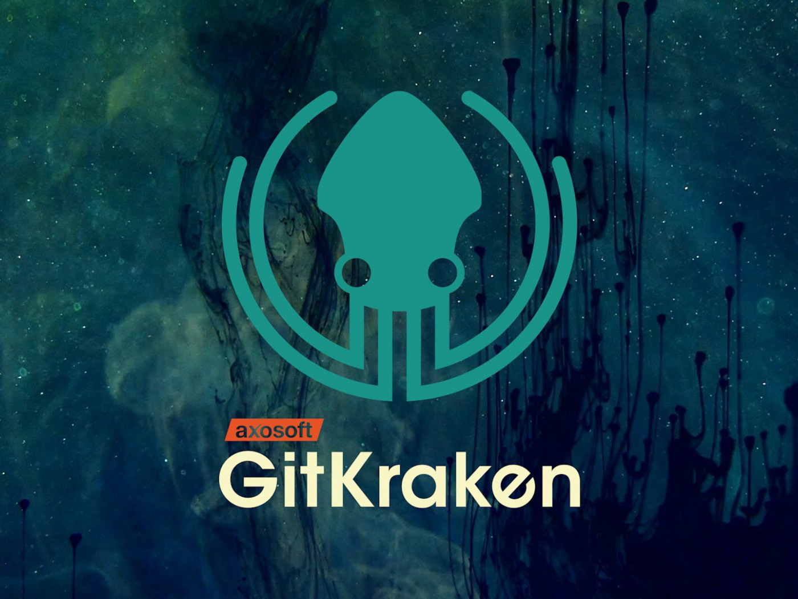

# It is instruction for [GIT](https://github.com/)

It is very friendly program 

1. **Create new dep**
* create new empty folder
* open Visual Studio Code
* open the folder in VSC
* open terminal
* create new file

2. **Write your text in VSCode**
* use # for titles
* use ## for little titles
* use * for italics
* use ** for bold
* use 1. for numbered lists
* use *   for unnumbered lists

3. **Basic commands fo GIT**
* git init: initialize an existing directory as a Git repository
* git status: show modified files in working directory, staged for your next commit
* git add: add a file as it looks now to your next commit (stage)
* git diff: diff of what is changed but not staged
* git commit -m: commit your staged content as a new commit snapshot
* git checkout: switch to another branch and check it out into your working directory
* git log: show all commits in the current branch’s history
* git checkout: switch to the last branch and check it out into your working directory

4. **How to work with remote:**
* Create account on GitHub.
* Create local rep.
* "To make friends" local and remote reps. GitHub will tell us what to do))
* Send (push) local rep to remote rep. Maybe make authorization.
* Make changes from another PC.
* Download (pull) actual rep from remote rep. 
