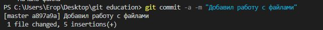
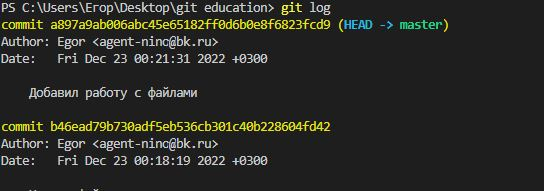
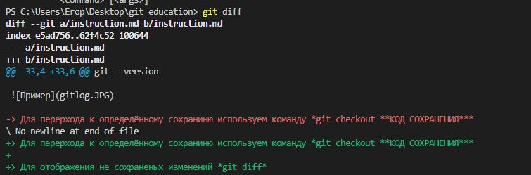
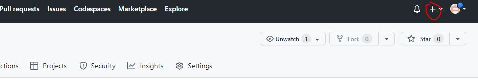
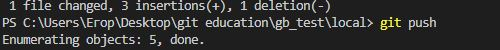
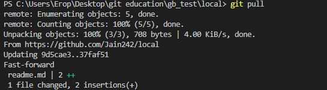
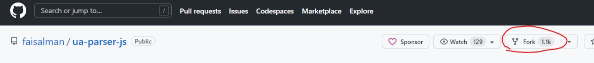
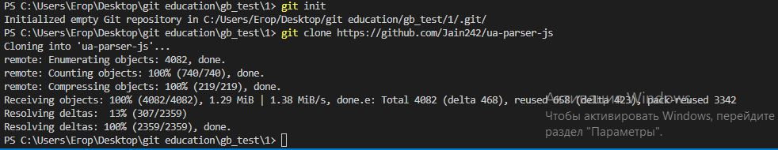

# Инструкция использования GIT
## Начало

Ещё не скаали программу? Не проблема, [нажми на меня](https://git-scm.com/download/win) и выбери свою **ОС**

**Пhоверка версии Git** 

git --version 

**Представимся GIT'у**

*git config --global user.email "***ВАША ПОЧТА***"*

*git config --global user.name "***Egor***"*

## Иницилизация GIT

1. Выбираем папку в которой бедем использовать Git
2. Пишем поманду *git init*
3. Создадим файл и добавим ему контроль версии при помощи команды *git add **ИМЯ_ФАЙЛА с расширением***

## Работа с файлом
>Для сохрания изменений пишем *git commi -a -m "*Комментарий*"*

>Для проверки состояния используем команду *git status*

>Для отображения всех версий сохранений есть команда *git log*

> Для перерхода к определённому сохраниню используем команду *git checkout **КОД СОХРАНЕНИЯ***

> Для отображения не сохранёных изменений *git diff*

## Создание ветвлений

1. Для создания ветки пишем команду *git branch* **Название ветки**

2. Создадим ветку branch1

3. Создадим ветку branch2

4. Создадим ветку 4

5. Для слияния веток используется команда *git merge*

6. Для удаления ветки *git branch -D **Имя ветки***

## Работа с GIT HUB

1. Регистрируемся на сайте GIT HUB

2. Создаём репозиторий

> Вводим имя

> Нажимаем Create repository

3. Выполняем команды 

>*git remote add origin **АДРЕС РЕПОЗИТОЯ***

>*git branch -M main*

>*git push -u origin main*

4. Для того, чтобы отправить изменения используем команду  *git push*

5. Что бы взять файл с репозитория используем *git pull*

6. Если хотите работать с фалами из чужого репозитория, используйте *fork*

7. Выбираем папку для локальной работы и иницилизируем его комнадой *git init*

8. Далее используем комнаду *git clone ULR*

