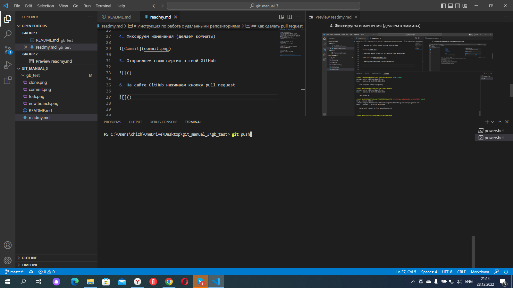

# Инструкция по работе с удаленными репозиториями

##  Как настроить совместную работу

1. Созлать аккаунт на GitHub.com
2. Создать локальный репозиторий
3. "Подружить” ваш локальный и удалённый репозитории. 
 GitHub при создании нового репозитория подскажет, как это можно сделать
4. Отправить (push) ваш локальный репозиторий в удаленный (на GitHub), при этом, возможно, вам нужно будет авторизоваться на удаленном репозитории
5. Провести изменения с "другого компьютера"
6. Выкачать (pull) актуальное состояние из удаленного репозитория

## Как сделать pull request

1. Делаем fork (ответвление) репозитория

2. Делаем git clone своей версии репозитория

3. Создаем новую ветку и в нее вносим свои изменения

4. Фиксируем изменения (делаем коммиты)

5. Отправляем свою версию в свой GitHub

6. На сайте GitHub нажимаем кнопку pull request

